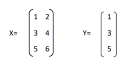
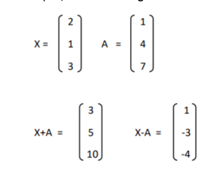
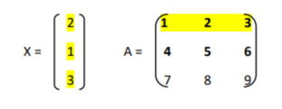
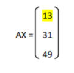
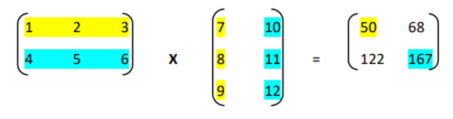
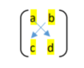

Basics of Linear Algebra
Matrix and Vectors

To understand machine learning in-depth, let us first understand a few topics related to linear algebra. You do not necessarily need to understand linear algebra in-depth, to get started with machine learning. However, it will be useful in understanding the mathematics behind machine learning algorithms.

In linear algebra, data is mostly represented using matrices and vectors.

Matrix

Matrices (plural of matrix) are used throughout machine learning algorithms, specifically for input variables, i.e., the variables we try to understand in machine learning. A matrix of size LaTeX: m\times n is a two-dimensional array that has m rows and n columns.

Vector

A vector is a one-dimensional array that has only one row - called a row vector, or just one column, also called a column vector.

For example, in the below figure, X is a matrix with 3 rows and 2 columns, while Y is a simple column vector.

Now, let’s look at some operations that can be applied to vectors and matrices.

Addition and Subtraction

For the addition and subtraction of two vectors or two matrices, both should be of the same size. The addition and subtraction operations are performed in an "element-wise" manner between the two objects - that is, the corresponding elements from the two vectors or matrices are added to each other or subtracted from each other.

For example, the below figure shows the addition and subtraction of two column vectors, each having 3 elements. 

This kind of "element-wise" addition and subtraction can similarly be performed for two or more matrices of the same size as well.

Multiplying a matrix with a vector

To multiply a matrix with a column (or row) vector, the matrix must have the same number of columns (or rows) as the number of elements in the column (or row) vector.

Let us look at an example of multiplying a matrix with a vector, where X is an LaTeX: n\times1 column vector and A is an LaTeX: m\times n matrix.

As the number of columns in A is equal to the number of elements in X, it is possible to find AX (A multiplied by X).

To do multiplication, we multiply each element of row 1 of the matrix with the corresponding element of the column vector and add them, i.e., (1*2 + 2*1 + 3*3) = 13. Similarly, we can apply the same operation to rows 2 and 3 of matrix A with the same three elements of X, and get the below result:

Multiplying a matrix with another matrix

One way to multiply a matrix with another matrix is what's known as the Dot Product.

To be able to multiply two matrices and get a dot product, the number of columns in the first matrix should equal the number of rows in the second matrix.

The resultant matrix would have the same number of rows as the first matrix and the same number of columns as the second matrix.

For example, the below figure shows the dot product of two matrices.

The first element, i.e., the element at the first row and the first column of the resultant matrix, would be: (1*7) + (2*8) + (3*9) = 50 
The second element, i.e., the element at the first row and the second column of the resultant matrix, would be: (1*10) + (2*11) + (3*12) = 68
The third element, i.e., the element at the second row and the first column of the resultant matrix, would be: (4*7) + (5*8) + (6*9) = 122
The last element, i.e., the element at the second row and the second column of the resultant matrix, would be: (4*10) + (5*11) + (6*12) = 167

Determinant of a matrix

The determinant of a matrix is a special number that can only be calculated from a square matrix, i.e., a matrix with the same number of rows and columns.

For example: A 2 x 2 or 3 x 3 matrix would be considered a square matrix.

For a 2 × 2 square matrix:

The determinant is calculated using the below formula:

 det(A)= a*d - b*c
"The determinant of A equals a times d minus b times c"

Note: In Python, vectors and matrices are represented as Numpy arrays. Numpy is one of the most popular linear algebra packages in Python and can be used to implement several basic mathematical operations on matrices, such as calculating dot products and determinants.