###

### Usage if matplotlib and seaborne library

#### versions info used the course -
### Python version -- 3.11.12 (main, Apr  9 2025, 08:55:54) [GCC 11.4.0]
### matplotlib version -- 3.10.0
### seaborn version -- 0.13.2

# Confidence Interval:
CI is a range of values around that estimate which is believed to contain
the true value of that estimate with a certain probability.

Example - CI of 95% - is range of values around that estimate which is believed to contain 
the true value of that estimate with a 95% probability.

### ########## Histogram ##########
# Histogram
####   #Univariate plot to understand distribution of a continuous numerical variable.
####   #It uses kde - "kernel distribution estimation" to smoothen the curve when there is noise in the date
####       #having kde enabled adds a bell curve distribution line over the histogram.

#### Limitation:
####    #It does represent the distribution better when there are multiple categories of data.

#import matplotlib.pyplot as plt
#(pyplt - plt)
#plt.title('Histogram:Price')
#plt.xlim(3000,50000)
#plt.ylim(0,70)
#plt.xlabel('Price of cars')
#plt.ylabel('Frequency')
#sns.histplot(data=df, x='price',color='orange');

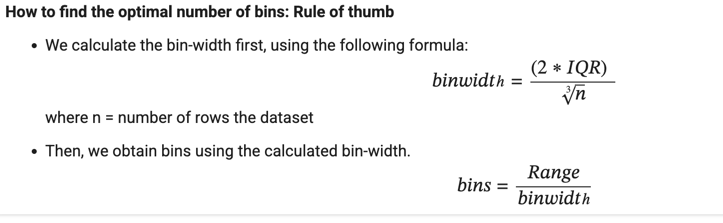
    
    Range refers to the difference between the maximum and minimum values of the specific feature (or variable) in your dataset for which you are plotting the histogram.

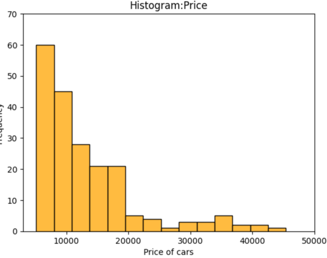

    We can specify the number of intervals (or groups or bins) to create by setting the bins parameter.
    If not specified it is passed to numpy.histogram_bin_edges()

    Interquartile Range (IQR):
    It's a measure of statistical dispersion, indicating the spread of the middle 50% of your data.
    To calculate it, you first need to understand quartiles:
    Q1 (First Quartile / Lower Quartile): This is the value below which 25% of the data falls. It's essentially the median of the lower half of your sorted dataset.
    Q3 (Third Quartile / Upper Quartile): This is the value below which 75% of the data falls. It's the median of the upper half of your sorted dataset.
    IQR = Q3 - Q1

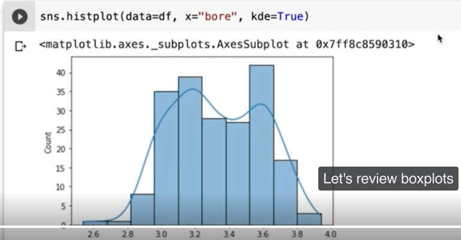

# Boxplot / Box-and-Whisker plot

A boxplot, or a box-and-whisker plot, shows the distribution of numerical data and skewness through displaying the data quartiles
It is also called a five-number summary plot, where the five-number summary includes the minimum value, first quartile, median, third quartile, and the maximum value.
The boxplot() function of seaborn can be used to create a boxplot.

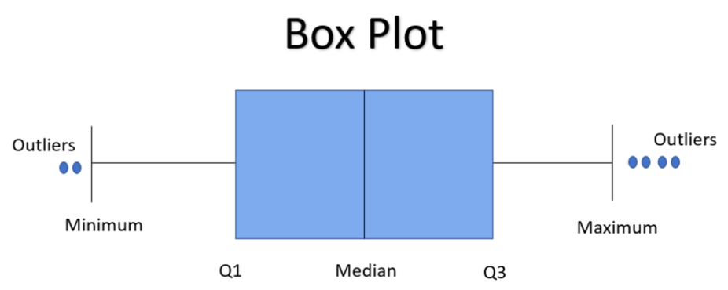

#Allows to compare distribution information across different groups.
#Plot helps to identify outliers in the data 
#Can detect skews in box plots using median and its relationship to the first quartile or the second

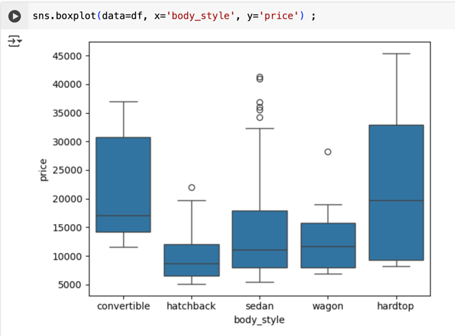

## For a single variable - we can use boxplots and histograms together to robustly refine our understanding of data

# Bar Graph

Bar Graph
A bar graph is generally used to show the counts of observations in each bin (or level or group) of categorical variable using bars.
We can use the countplot() function of seaborn to plot a bar graph.
#make the plot more granular by specifying the hue parameter to display counts for subgroups.

## help / documentation section of "sns.countplot" 
## /usr/local/lib/python3.11/dist-packages/seaborn/categorical.py
## #Show the counts of observations in each categorical bin using bars.

## A count plot can be thought of as a histogram across a categorical, instead
## of quantitative, variable. The basic API and options are identical to those
## for :func:`barplot`, so you can compare counts across nested variables.

## Note that :func:`histplot` function offers similar functionality with additional
## features (e.g. bar stacking), although its default behavior is somewhat different.

sns.countplot(data=df x='body_style' hue='fuel_type')

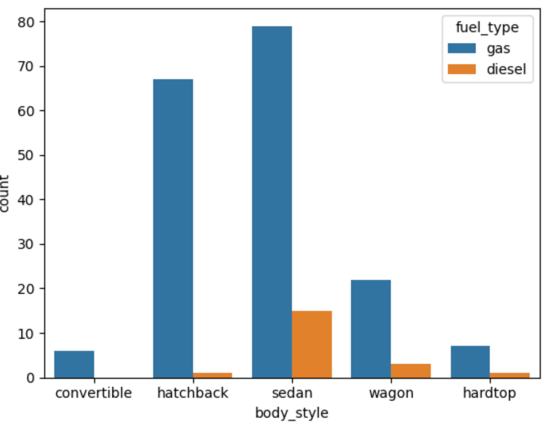

#sample code
 #plt.figure(figsize=(10,7))
 #plt.title('Barplot:Engine-type')
 #plt.ylim(0,180)
 #sns.countplot(data=df, x='engine_type',hue='fuel_type')
 #plt.xlabel('Engine-type');

## Line Graph / Line Plot
Used to show multiple y values and x values.
When data evolves over time, to visualize this line plot works.

#A line plot uses straight lines to connect individual data points to display a trend or pattern in the data.

For example, seasonal effects and large changes over time.
#The lineplot() function of seaborn, by default, aggregates over multiple y values at each value of x and uses an estimate of the central tendency for the plot.

#lineplot() assumes that you are most often trying to draw y as a function of x. 
#So, by default, it sorts the data by the x values before plotting.

#The light blue shaded area is actually the 'confidence interval' of the y-value 
estimates for each x-axis value.

#The confidence interval is a range of values around that estimate 
#that are believed to contain the true value of that estimate 
#with a certain probability.

#line point with markers

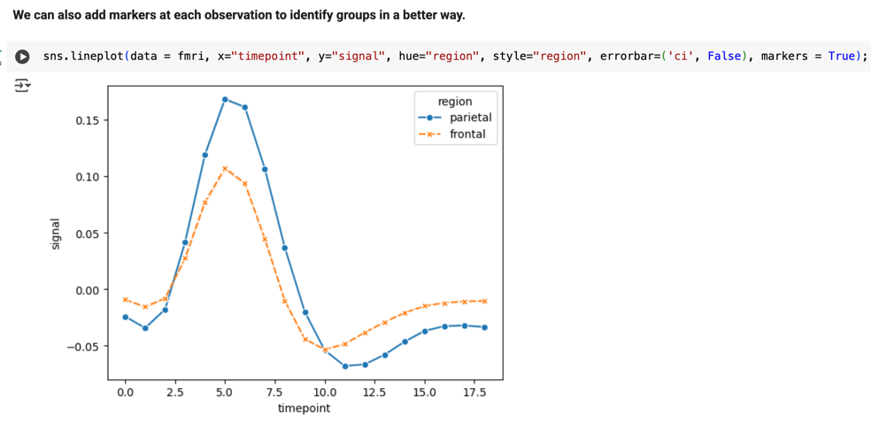

### Scatter Plot

#A scatter plot is an analytical tool 

#It shows a statistical relationship between two continuous variable. 

#Used to understand correlation, detect outliers & draw the best-fit
#-in linear regression

#lmplot() function plots a scatter plot and also fits a 
linear model with a confidence interval (default 95%) for the fitted model.

#positive correlation example
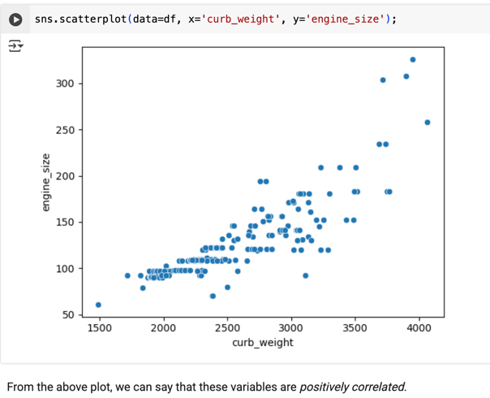

### Join Plot

#It comprises three plots - 
one displays the relationship between two variables while the other 
two show the individual distribution of each variable in the margins.

#A jointplot helps to quickly visualize the bivariate and univariate profiles on the same plot.

sns.jointplot(data=df, x='price', y='city_mpg', kind="reg");

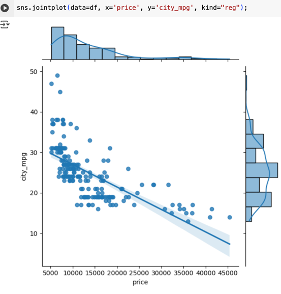

### Violin plot

A violin plot is used to visualize the distribution of numerical data.
It also depicts the summary statistics and the density of each variable.

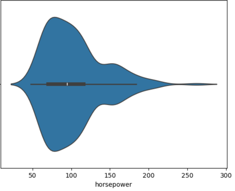

plt.figure(figsize=(11,9));
sns.violinplot(data=df, hue='body_style', y='engine_size', palette='colorblind');

#x is an optional for single distribution or for grouping

#hue parameter (e.g., hue='body_style'): This is also used for a categorical variable

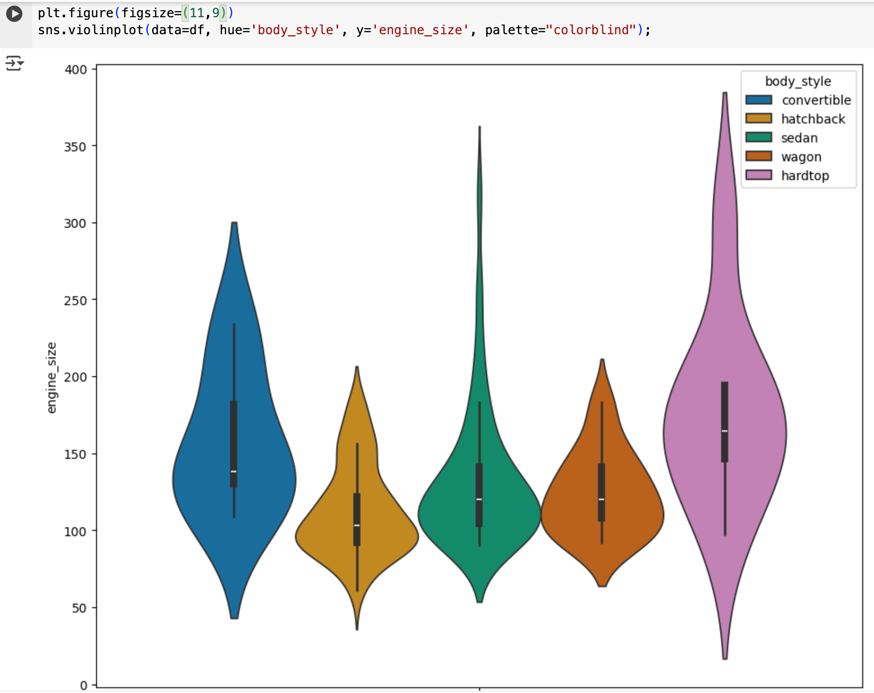

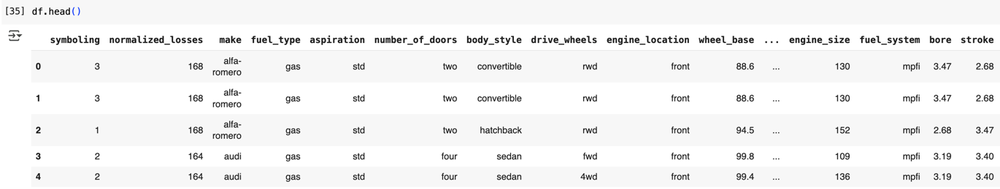

### Strip plot

Its a scatter plot and allows us to differentiate between different categories.
It can be particularly helpful for doing univariate data analysis.
 - for datasets that have smaller number of observations between categories.

#Is very helpful for doing 